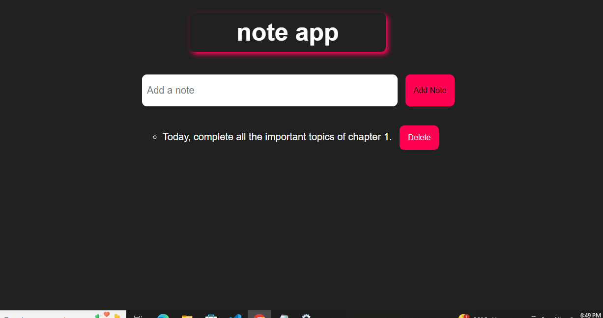

# Getting Started with Create React App

## `npm start`

Runs the app in the development mode.\
Open [http://localhost:3000](http://localhost:3000) to view it in your browser.

## Note-app

The provided code is a simple Note App built using React. It allows users to add, display, and delete notes.

-> To build this app from scratch, follow these steps:

a) Create a new React app using create-react-app.
b) Import the useState hook from React.
c) Define the notes and newNote state variables using useState.
d) Create the handleSubmit and handleDelete event handlers.
e) Build the JSX components, including the form, input field, button, and list of notes.
f) Use the map function to render the list of notes.
g) Add CSS styles to make the app look visually appealing.
